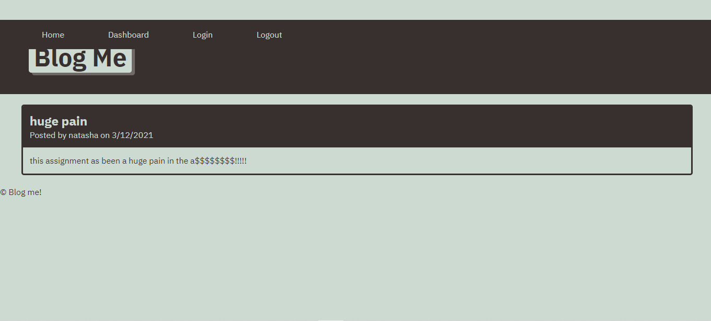

# blog-me
# blog-me 

#Table of Contents

-[Description](#description)
-[Usage](#useage)
-[Languages](#languages)
-[Collaborators](#collaborators)
-[License](#license)
-[Links](#links)
-[Questions](#questions)

 ## Description:
 
 This is a blog app. Let everyone read your blogs! you can also comment on other users blogs.
 
 ## Usage:
 this is deployed on heroku so it doesn't need any installs. however, if you are pulling code off github please npm i before use. then npm start to start the app.

## languages:
bcrypt
connect-session-sequelize
dotenv
express
express-handlebars
express-session
mysql
mysql2
sequelize

# collaborators
I used the style sheet from the gitlab style sheet code. 
Mongo DB tutorial https://www.youtube.com/watch?v=esKNjzDZItQ

 ## Picture:
 
 
 ## License
 For more info about the License, click on the link below.

 ## Links
 Link to the GitHub 
[link](https://github.com/natashamullin/blog-me)
Link to the deployed project
[link](https://mysterious-falls-58120.herokuapp.com/)

## Questions 
please reach me at my GubHub account or through Email if you have any questions
Natasha Mullin; [link](github.com/natashamullin)
[link](Natashamullin0826889@yahoo.com)

